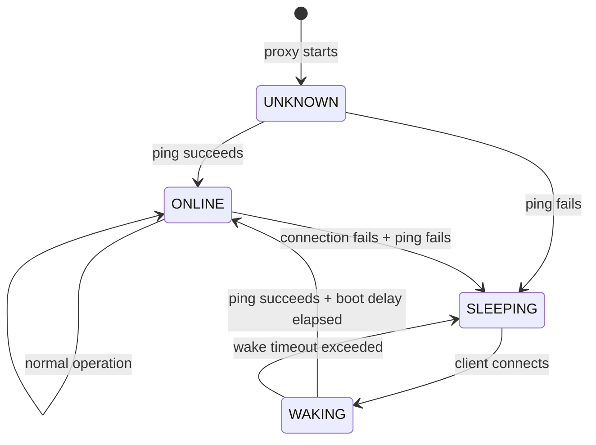
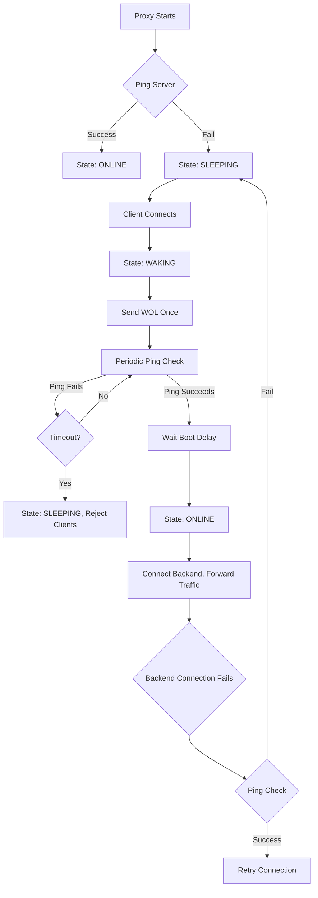

# WOL Proxy Redesign Plan

## Overview

Redesign the wol-proxy to implement a clean state machine for managing server wake-up, with the following key changes:
1. Remove SSL/SSH logic (server handles its own startup)
2. Send WOL exactly once per wake cycle
3. Use ping only during WAKING state to detect boot completion
4. Detect server sleep via connection failures

## Configuration Defaults

| Parameter | Default | Description |
|-----------|---------|-------------|
| boot-delay | 5s | Wait after ping succeeds for app startup |
| wake-timeout | 60s | Max time to wait for server to wake |
| ping-interval | 5s | Interval between ping checks during WAKING |

## Current Implementation Issues

### [`wol.hpp`](wol.hpp)
- `wol()` function sends WOL in a loop with retry
- Mixes WOL sending with ping checking
- Returns bool but has complex retry logic

### [`WolProxy.hpp`](WolProxy.hpp)
- Calls `wol()` on every client connect
- Has SSH logic that should be removed
- No state tracking for server status

## Proposed Architecture

### State Machine



### Flow Diagram



## Implementation Details

### 1. ServerState Enum

```cpp
enum class ServerState {
    UNKNOWN,   // Initial state, not yet determined
    SLEEPING,  // Server is down, WOL not yet sent
    WAKING,    // WOL sent, waiting for server to boot
    ONLINE     // Server is up and accepting connections
};
```

### 2. WolProxy Class Changes

```cpp
class WolProxy: public TcpProxy {
public:
    WolProxy();
    virtual ~WolProxy() {}
    
    void forward(int port, const string& host, int hport, 
                 const string& wolip, const string& mac,
                 int bootDelay = 5, int wakeTimeout = 60);

protected:
    // State management
    ServerState serverState = ServerState::UNKNOWN;
    time_t wakeStartTime = 0;
    bool wolSent = false;
    
    // Configuration
    string wolip;
    string mac;
    int bootDelay;      // Seconds to wait after ping succeeds
    int wakeTimeout;    // Max seconds to wait for server to wake
    
    // Pending clients during wake-up
    struct PendingClient {
        int fd;
        string addr;
        string initialData;
    };
    vector<PendingClient> pendingClients;
    
    // Override hooks
    void onClientConnect(int fd, const string& addr) override;
    void onRawData(int clientFd, string& buf) override;
    void onTick() override;
    
    // State handlers
    void checkInitialState();
    void handleSleepingState(int fd, const string& addr);
    void handleWakingState();
    void transitionToOnline();
    void processPendingClients();
    
    // Helpers
    bool pingServer();
    void sendWol();
};
```

### 3. Key Behavior Changes

#### onClientConnect
```
if state == UNKNOWN:
    checkInitialState()  // Ping to determine state
    
if state == SLEEPING:
    sendWol()            // Send WOL once
    state = WAKING
    wakeStartTime = now()
    add client to pendingClients
    
if state == WAKING:
    add client to pendingClients
    
if state == ONLINE:
    TcpProxy::onClientConnect()  // Normal connection
```

#### onTick (called every 100ms)
```
if state == WAKING:
    if now() - wakeStartTime > wakeTimeout:
        state = SLEEPING
        reject all pendingClients
        wolSent = false
    else if pingServer():
        if pingSuccessTime == 0:
            pingSuccessTime = now()
        else if now() - pingSuccessTime >= bootDelay:
            state = ONLINE
            processPendingClients()
            wolSent = false
            pingSuccessTime = 0
```

**IMPORTANT**: Do NOT use blocking `sleep()` in `onTick()` - it freezes the event loop. Use non-blocking timer pattern with `pingSuccessTime` to track elapsed time.

#### onRawData
```
if state == WAKING:
    // Buffer data from pending clients
    append to pendingClient.initialData
else:
    TcpProxy::onRawData()  // Normal forwarding
```

#### Backend Connection Failure Detection
```
When backend->connect() fails:
    if pingServer():
        // Server is up, retry connection
        retry backend connection
    else:
        // Server went to sleep
        state = SLEEPING
        wolSent = false       // Reset WOL flag for next wake cycle
        pingSuccessTime = 0   // Reset boot delay timer
        disconnect all clients
```

**Note**: Both `wolSent` and `pingSuccessTime` must be reset when transitioning to SLEEPING to ensure clean state for next wake cycle.

### 4. wol.hpp Refactoring

Split into two functions:

```cpp
// Send WOL packet once (no retry, no ping)
inline bool wol_send(const string& wolip, const string& mac, const string& broadcast_addr = "255.255.255.255");

// Check if server responds to ping
inline bool ping(const string& addr, const string& cmd_ping = "ping -c 1 -W 1 {{addr}}");
```

### 5. Command Line Arguments

Remove:
- `user` (SSH user)
- `cmd` (SSH command)

Add:
- `--boot-delay` or `-b`: Seconds to wait after ping succeeds (default: 5)
- `--wake-timeout` or `-w`: Max seconds to wait for wake (default: 60)

New usage:
```
wol-proxy <port> <host:port> <wolip> <mac> [--boot-delay=N] [--wake-timeout=N]
```

## Files to Modify

1. **[`wol.hpp`](wol.hpp)**: Remove retry loop, keep only `wol_send()` and `ping()`
2. **[`WolProxy.hpp`](WolProxy.hpp)**: Implement state machine, remove SSH, add pending client handling
3. **[`wol-proxy.cpp`](wol-proxy.cpp)**: Update arguments, remove SSH parameters

## Utility Classes from cpptools/misc

### Timer.hpp - NOT SUITABLE
The `Timer` class spawns a separate thread with blocking `sleep_for()`. Do NOT use for this project because:
- It spawns a separate thread (conflicts with single-threaded event loop)
- Uses blocking sleep (defeats the purpose of non-blocking design)
- Designed for periodic callbacks, not integration into `select()` event loop

### Stopper.hpp - OPTIONAL
A stopwatch utility for measuring elapsed time. Can be used but simpler alternatives exist:
- `Stopper stopper; stopper.start(); ... double ms = stopper.getElapsedMs();`
- More features than needed (pause/resume, formatted output)

### Recommended: Simple time_t timestamps
For this project, use simple `time_t` timestamps (already used in TcpProxy):
```cpp
#include <ctime>
time_t startTime = time(nullptr);
if (time(nullptr) - startTime >= timeoutSec) { /* timeout */ }
```
- `time(nullptr)` returns Unix timestamp in seconds
- Simple, no dependencies, sufficient for second-level timeouts
- For millisecond precision, use `get_time_ms()` from `cpptools/misc/get_time_ms.hpp`

## Testing Strategy

1. Test with server already online (should skip WOL)
2. Test with server sleeping (should send WOL once)
3. Test multiple clients during wake-up (should queue and connect all)
4. Test server going to sleep during operation (should detect and restart cycle)
5. Test wake timeout (should reject clients after timeout)
